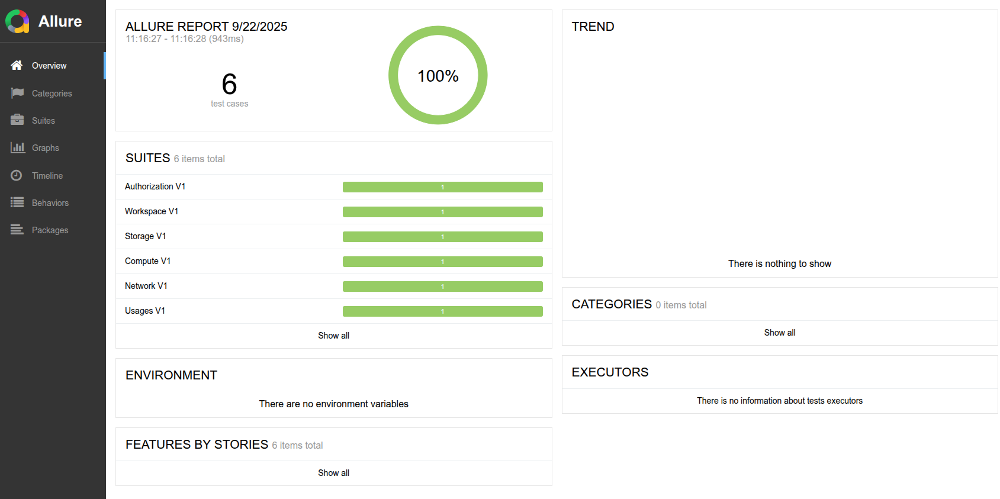

# conformance
# SECA Conformance Tests

A comprehensive conformance testing tool to validate a Cloud Service Provider (CSP) of the [SECA API specification](https://spec.secapi.cloud).

## Overview

SECA Conformance ensure that CSP implementations comply with the standardized API specification for sovereign cloud services. This tool validates API endpoints, resource lifecycle management, and compliance with SECA standards across multiple cloud providers.

## Requirements

- Go 1.24 or higher;
- [Allure Report](https://allurereport.org/docs/install/);
- Linux base SO or Linux compatible shell.

### Installation

```bash
git clone https://github.com/eu-sovereign-cloud/conformance
cd conformance
make ./dist/secatest
```

## Configuration

The following configurations are required to run the tool. These configurations can be set as command line parameters or environment variables:


| Parameter                         | Variable                         | Description                                                 |
|-----------------------------------|----------------------------------|-------------------------------------------------------------|
| `-seca.provider.region.v1`        | `SECA_PROVIDER_REGION_V1`        | URL of a Region V1 provider API implementation              |
| `-seca.provider.authorization.v1` | `SECA_PROVIDER_AUTHORIZATION_V1` | URL of a Authorization V1 provider API implementation       |
| `-seca.client.authtoken`          | `SECA_CLIENT_AUTH_TOKEN`         | Valid JWT token to access the CSP API's                     |
| `-seca.client.tenant`             | `SECA_CLIENT_TENANT`             | Name of the Tenant used in the tests                        |
| `-seca.client.region`             | `SECA_LIENT_REGION`              | Name of the Region used in the tests                        |
| `-seca.scenario.users`            | `SECA_SCENARIO_USERS`            | Comma-separated list of valid CSP users                     | 
| `-seca.scenario.cidr`             | `SECA_SCENARIO_CIDR`             | CIDR range availabed in the CSP to create network resources |
| `-seca.scenario.publicips`        | `SECA_SCENARIO_PUBLIC_IPS`       | Public IPs range, in CIDR format, to create CSP public IP's |

## Running

To run the conformance tests, set the [configuration](#configuration) variables and run the following command:
```bash
./dist/secatest -seca.provider.region.v1=#REGION_API \
  -seca.provider.authorization.v1=#AUTHORIZATION_API \
  -seca.client.authtoken=#TOKEN \
  -seca.client.region=#REGION \
  -seca.client.tenant=#TENANT \
  -seca.scenario.users=#USERS \
  -seca.scenario.cidr=#CIDR \
  -seca.scenario.publicips=#PUBLIC_IPS
```

## Viewing Result
To see the the result report run the following command:
```bash
make report
```

Your default browser will be opened, with the Allure Report viewer:

